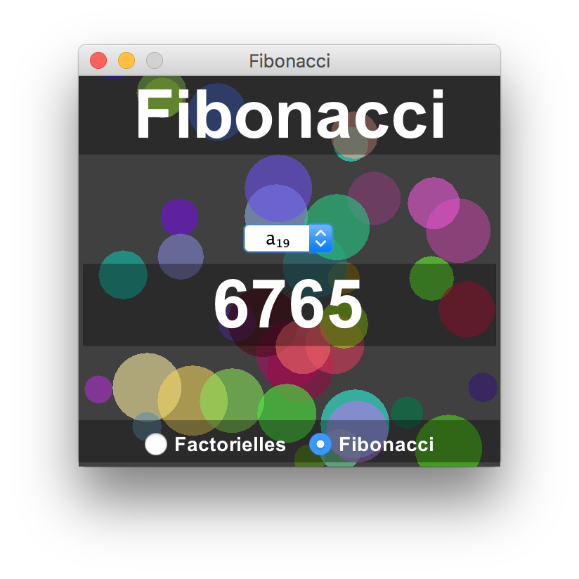
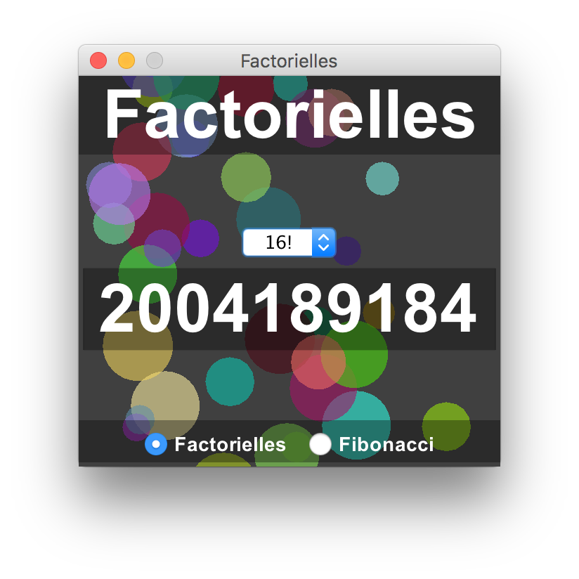

# Fibonacci/Factorials Calculator

<table>
  <tr>
    <td></td>
    <td></td>
  </tr>
</table>

***English***

A small application I wrote for a French presentation, in Java, I did on recursion. It calculates numbers in the fibonacci sequence and factorials recursively and displays them on a small, clean and aesthetically pleasing user interface.

This application can be run as follows:

```bash
javac interfaceUtilsateur.java    # compile
java interfaceUtilsateur          # run
```
<br>
---
<br>

***Français***

Un petit programme que j'ai écrit pour une exposé en français sur récursivité. Ce programme calcule des nombres dans la séquence de Fibonacci et factorielles et les affiche sur une interface utilisateur belle et simple.

Ce programme peut être exécuté avec la commande suivante:

```bash
javac interfaceUtilsateur.java    # compile
java interfaceUtilsateur          # exécute
```
